# TradeCore Database Entity-Relationship (ER) Diagram & Architecture

This document presents the complete 9-schema database architecture and Entity-Relationship (ER) diagram for the **TradeCore** platform PostgreSQL database (`tradecore`).

---

## 1. 9-Schema Domain Architecture Overview

The `tradecore` PostgreSQL database is organized into **9 domain schemas** to isolate business concerns, maximize query performance, and ensure independent scale-out readiness:

```
                      ┌─────────────────────────────────────────────────────────┐
                      │              PostgreSQL: tradecore                      │
                      └────────────────────────────┬────────────────────────────┘
                                                   │
        ┌──────────────┬──────────────┬────────────┼────────────┬──────────────┬──────────────┬──────────────┬──────────────┐
        │              │              │            │            │              │              │              │              │
  ┌─────▼────┐   ┌─────▼────┐   ┌─────▼────┐ ┌─────▼────┐ ┌─────▼────┐   ┌─────▼────┐   ┌─────▼────┐   ┌─────▼────┐   ┌─────▼────┐
  │ identity │   │  market  │   │ trading  │ │ journal  │ │ backtest │   │ research │   │ scanner  │   │    ai    │   │  system  │
  └──────────┘   └──────────┘   └──────────┘ └──────────┘ └──────────┘   └──────────┘   └──────────┘   └──────────┘   └──────────┘
```

1. **`identity`**: User accounts, OAuth authentication tokens, user preferences, and dashboard configurations.
2. **`market`**: Central shared market data read by all modules (`symbols`, `market_data`, partitioned `market_candles`, `pivot_levels`, `corporate_actions`, `trading_sessions`, `holidays`, `metadata`).
3. **`trading`**: Live and historical executive trading records, strategy rules, chart images, and execution snapshots.
4. **`journal`**: Structured trade journaling, daily recaps, technical & confirmation checklists, and tag registries.
5. **`backtest`**: Historical strategy simulation runs, simulated executions, and quantitative performance analytics.
6. **`research`**: Quantitative research notebooks, alpha factor computations, and custom indicator definitions.
7. **`scanner`**: Real-time pattern detection results, alert triggers, Telegram bot configurations, and scanner templates.
8. **`ai`**: Voice journal processing, Whisper transcriptions, LLM summaries, emotion tagging, and AI chat histories.
9. **`system`**: Global application configuration, security audit trail, background task logs, and schema migration tracking.

---

## 2. ER Diagram (Mermaid)

```mermaid
erDiagram

    %% IDENTITY SCHEMA
    identity_users ||--o{ identity_user_oauth_accounts : "has (1:N)"
    identity_users ||--o| identity_user_market_preferences : "configures (1:1)"
    identity_users ||--o{ identity_dashboard_preferences : "customizes (1:N)"
    identity_users ||--o{ identity_watchlist : "tracks (1:N)"

    %% TRADING SCHEMA
    identity_users ||--o{ trading_strategies : "owns (1:N)"
    identity_users ||--o{ trading_trades : "logs (1:N)"
    trading_strategies ||--o{ trading_trades : "applied to (1:N)"
    trading_trades ||--o{ trading_trade_images : "contains (1:N)"
    trading_trades ||--o| trading_trade_market_snapshot : "captures (1:1)"

    %% JOURNAL SCHEMA
    identity_users ||--o{ journal_journal_entries : "writes (1:N)"
    identity_users ||--o{ journal_technical_checklists : "configures (1:N)"
    identity_users ||--o{ journal_confirmation_checklists : "configures (1:N)"
    identity_users ||--o{ journal_journal_tags : "defines (1:N)"

    %% BACKTEST SCHEMA
    identity_users ||--o{ backtest_backtest_runs : "executes (1:N)"
    trading_strategies ||--o{ backtest_backtest_runs : "simulates (1:N)"
    backtest_backtest_runs ||--o{ backtest_backtest_trades : "generates (1:N)"
    backtest_backtest_runs ||--o| backtest_backtest_metrics : "evaluates (1:1)"

    %% RESEARCH SCHEMA
    identity_users ||--o{ research_research_notebooks : "author (1:N)"
    identity_users ||--o{ research_custom_studies : "creates (1:N)"

    %% SCANNER SCHEMA
    identity_users ||--o{ scanner_scanner_settings : "manages (1:1)"
    identity_users ||--o{ scanner_scanner_templates : "saves (1:N)"

    %% AI SCHEMA
    identity_users ||--o{ ai_voice_journals : "records (1:N)"
    trading_trades ||--o| ai_voice_journals : "links to (1:1)"
    identity_users ||--o{ ai_ai_conversations : "chats (1:N)"
    identity_users ||--o{ ai_ai_insights : "receives (1:N)"

    %% SYSTEM SCHEMA
    identity_users ||--o{ system_audit_logs : "triggers (1:N)"

    %% ENTITY DEFINITIONS BY SCHEMA

    %% --- IDENTITY ---
    identity_users {
        uuid id PK
        string email UK
        string hashed_password
        string full_name
        string auth_provider
        boolean is_active
        datetime created_at
        datetime updated_at
    }

    identity_user_oauth_accounts {
        uuid id PK
        uuid user_id FK
        string provider
        string provider_user_id
        string provider_email
        string provider_name
        string provider_avatar
        string client_id
        string client_secret
        string access_token
        string refresh_token
        datetime token_expiry
        string drive_folder_id
        datetime created_at
        datetime updated_at
    }

    identity_user_market_preferences {
        uuid id PK
        uuid user_id FK,UK
        jsonb favorite_symbols
        jsonb visible_reference_levels
        jsonb dashboard_layout
        jsonb broker_credentials
        datetime created_at
        datetime updated_at
    }

    identity_dashboard_preferences {
        uuid id PK
        uuid user_id FK
        jsonb selected_symbols
        jsonb widget_visibility
        jsonb widget_order
        string layout_name
        datetime created_at
        datetime updated_at
    }

    identity_watchlist {
        uuid id PK
        uuid user_id FK
        string symbol
        string market
        integer position
        jsonb settings
        datetime created_at
    }

    %% --- MARKET (Shared Source of Truth - Decoupled) ---
    market_symbols {
        uuid id PK
        string exchange
        string segment
        string symbol
        string instrument_token
        numeric tick_size
        integer lot_size
        string currency
        string timezone
        boolean active
        datetime created_at
    }

    market_market_data {
        uuid id PK
        string symbol UK
        string market UK
        numeric live_price
        numeric trueday_open
        numeric previous_trueday_open
        numeric indian_midnight_open
        numeric previous_day_high
        numeric previous_day_low
        numeric previous_day_close
        numeric current_day_high
        numeric current_day_low
        numeric daily_range
        jsonb cpr_levels
        jsonb camarilla_levels
        string timezone_info
        datetime last_updated
    }

    market_market_candles {
        uuid id
        string symbol PK
        string timeframe PK
        datetime datetime PK
        numeric open
        numeric high
        numeric low
        numeric close
        numeric volume
        string source
        datetime created_at
        datetime updated_at
    }

    market_pivot_levels {
        uuid id PK
        string symbol UK
        string market UK
        date date UK
        numeric cpr_pivot
        numeric cpr_tc
        numeric cpr_bc
        numeric camarilla_r1
        numeric camarilla_r2
        numeric camarilla_r3
        numeric camarilla_r4
        numeric camarilla_s1
        numeric camarilla_s2
        numeric camarilla_s3
        numeric camarilla_s4
        datetime created_at
    }

    market_corporate_actions {
        uuid id PK
        string symbol UK
        string action_type UK
        date ex_date UK
        date record_date
        date payment_date
        numeric ratio_denominator
        numeric ratio_numerator
        numeric amount
        string currency
        string description
        datetime created_at
    }

    %% --- TRADING ---
    trading_strategies {
        uuid id PK
        uuid user_id FK
        string name
        string description
        jsonb rules
        jsonb risk_rules
        datetime created_at
    }

    trading_trades {
        uuid id PK
        uuid user_id FK
        uuid strategy_id FK
        date trade_date
        time trade_time
        string market
        string symbol
        string direction
        string status
        string trading_type
        string segment
        numeric entry_price
        numeric stop_loss
        numeric target_price
        numeric exit_price
        numeric quantity
        numeric net_profit
        numeric r_multiple
        integer holding_minutes
        integer confidence_rating
        jsonb setup
        jsonb psychology
        jsonb notes
        jsonb analytics
        jsonb metadata
        array_string tags
        datetime created_at
        datetime updated_at
    }

    trading_trade_images {
        uuid id PK
        uuid trade_id FK
        string category
        string google_file_id
        string file_url
        string caption
        jsonb extra_data
        datetime created_at
    }

    trading_trade_market_snapshot {
        uuid id PK
        uuid trade_id FK,UK
        string symbol
        numeric live_price
        numeric trueday_open
        numeric previous_trueday_open
        numeric indian_midnight_open
        numeric previous_day_high
        numeric previous_day_low
        numeric previous_day_close
        numeric current_day_high
        numeric current_day_low
        numeric daily_range
        jsonb cpr_levels
        jsonb camarilla_levels
        snapshot_at datetime
    }

    %% --- JOURNAL ---
    journal_journal_entries {
        uuid id PK
        uuid user_id FK
        date entry_date
        string title
        string content
        integer mood_score
        array_string lessons_learned
        datetime created_at
        datetime updated_at
    }

    journal_technical_checklists {
        uuid id PK
        uuid user_id FK
        string name
        boolean is_enabled
        integer order_idx
        datetime created_at
        datetime updated_at
    }

    journal_confirmation_checklists {
        uuid id PK
        uuid user_id FK
        string name
        boolean is_enabled
        integer order_idx
        datetime created_at
        datetime updated_at
    }

    journal_journal_tags {
        uuid id PK
        uuid user_id FK
        string tag_name UK
        string color_code
        datetime created_at
    }

    %% --- BACKTEST ---
    backtest_backtest_runs {
        uuid id PK
        uuid user_id FK
        uuid strategy_id FK
        string symbol
        string timeframe
        datetime start_date
        datetime end_date
        numeric initial_capital
        jsonb parameters
        string status
        datetime created_at
    }

    backtest_backtest_trades {
        uuid id PK
        uuid backtest_id FK
        string symbol
        datetime entry_time
        datetime exit_time
        string direction
        numeric entry_price
        numeric exit_price
        numeric quantity
        numeric pnl
        numeric r_multiple
    }

    backtest_backtest_metrics {
        uuid id PK
        uuid backtest_id FK,UK
        integer total_trades
        numeric win_rate
        numeric profit_factor
        numeric sharpe_ratio
        numeric max_drawdown
        jsonb equity_curve
        datetime created_at
    }

    %% --- RESEARCH ---
    research_research_notebooks {
        uuid id PK
        uuid user_id FK
        string title
        string description
        jsonb notebook_data
        datetime created_at
        datetime updated_at
    }

    research_factor_data {
        uuid id PK
        string symbol UK
        string factor_name UK
        date date UK
        numeric factor_value
        jsonb metadata
        datetime created_at
    }

    research_custom_studies {
        uuid id PK
        uuid user_id FK
        string study_name
        string code_content
        boolean is_public
        datetime created_at
    }

    %% --- SCANNER ---
    scanner_screener_results {
        uuid id PK
        string symbol
        string market
        string pattern
        string timeframe
        numeric entry_price
        numeric stop_loss
        numeric target_price
        numeric confidence_score
        datetime scanned_at
    }

    scanner_scanner_results {
        uuid id PK
        string symbol
        string market
        string scanner_name
        string timeframe
        string signal_type
        numeric price
        numeric confidence_score
        jsonb details
        datetime_tz triggered_at
        boolean telegram_sent
        datetime created_at
    }

    scanner_scanner_settings {
        uuid id PK
        uuid user_id FK
        jsonb enabled_scanners
        string telegram_bot_token
        string telegram_chat_id
        boolean telegram_enabled
        jsonb telegram_alert_types
        datetime created_at
        datetime updated_at
    }

    scanner_scanner_templates {
        uuid id PK
        uuid user_id FK
        string name
        string description
        jsonb conditions
        datetime created_at
        datetime updated_at
    }

    %% --- AI ---
    ai_voice_journals {
        uuid id PK
        uuid user_id FK
        uuid trade_id FK,UK
        string audio_url
        string transcript
        string original_transcript
        string corrected_transcript
        jsonb ai_summary
        jsonb emotion_tags
        string status
        string error_message
        datetime created_at
    }

    ai_ai_conversations {
        uuid id PK
        uuid user_id FK
        string title
        jsonb messages
        jsonb context_data
        datetime created_at
        datetime updated_at
    }

    ai_ai_insights {
        uuid id PK
        uuid user_id FK
        string insight_type
        string summary
        jsonb details
        datetime created_at
    }

    %% --- SYSTEM ---
    system_system_settings {
        string key PK
        jsonb value
        string description
        datetime updated_at
    }

    system_audit_logs {
        uuid id PK
        uuid user_id FK
        string action
        string resource
        string ip_address
        jsonb details
        datetime created_at
    }

    system_task_execution_logs {
        uuid id PK
        string task_name
        string status
        integer execution_time_ms
        string error_message
        jsonb metadata
        datetime created_at
    }

    system_schema_migrations {
        string version PK
        string description
        datetime applied_at
    }
```



---

## 3. Key Architecture & Design Highlights

### ⚡ Partitioned Time-Series Market Candles (`market.market_candles`)
- **Range Partitioning**: `market.market_candles` is partitioned natively by `RANGE (datetime)`.
- **Compound Primary Key**: PostgreSQL requires partition keys to be part of all unique indexes/primary keys. The primary key is `(symbol, timeframe, datetime)`.
- **Pre-provisioned & Dynamic Partitions**: Pre-created yearly partitions (`market_candles_y2022` to `y2028` + `default`), with a PL/pgSQL helper function (`market.create_candle_partition_if_not_exists(target_year INT)`) for dynamic annual partition creation.

### 🌐 Shared Source of Truth & Decoupled Market Architecture
- `market` schema acts as a central read-heavy data layer for `trading`, `scanner`, `backtest`, `research`, `journal`, `ai`, and `system`.
- Other domain tables reference market objects via logical string identifiers (`symbol`, `market`, `timeframe`) rather than hard physical SQL Foreign Keys pointing to `market.market_candles` / `market.symbols`.
- **Scale-Out Readiness**: If market data expands beyond what a single database comfortably handles years down the line, the `market` schema (or `market_candles` table) can be moved to TimescaleDB, ClickHouse, or a dedicated database cluster without breaking relational integrity or altering schemas in `identity`, `trading`, `journal`, `backtest`, `research`, `scanner`, `ai`, or `system`.

### 🔒 OAuth Token Isolation (`identity.user_oauth_accounts`)
- Volatile OAuth access/refresh tokens and drive credentials are kept in `identity.user_oauth_accounts` separate from `identity.users` to eliminate lock contention on user rows during token rotation.

### 📊 Indexing & Query Optimization
- Normalized high-frequency query metrics (`r_multiple`, `holding_minutes`, `confidence_rating`) in `trading.trades`.
- PostgreSQL **GIN Indexes** on `setup`, `psychology`, `analytics`, and `tags` JSONB / Array columns for millisecond-level filtering.
- PostgreSQL **`search_path`** configured as `identity, market, trading, journal, backtest, research, scanner, ai, system, public`.
